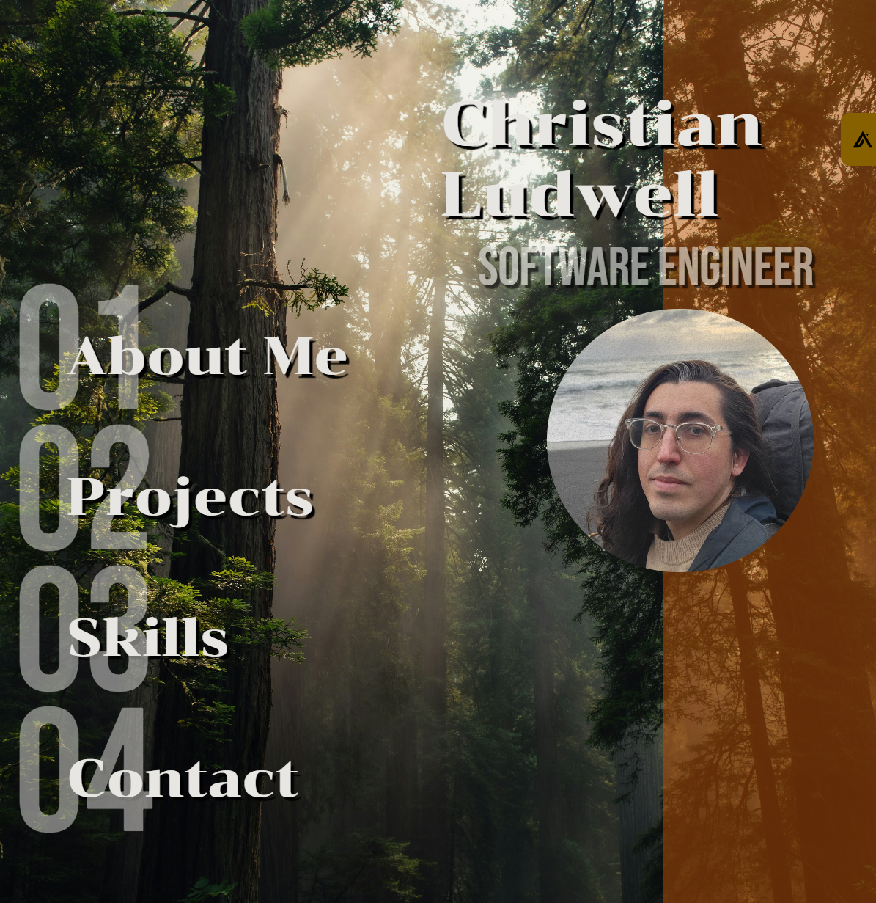
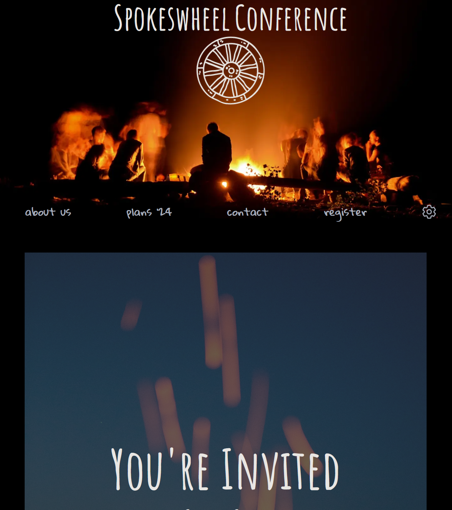
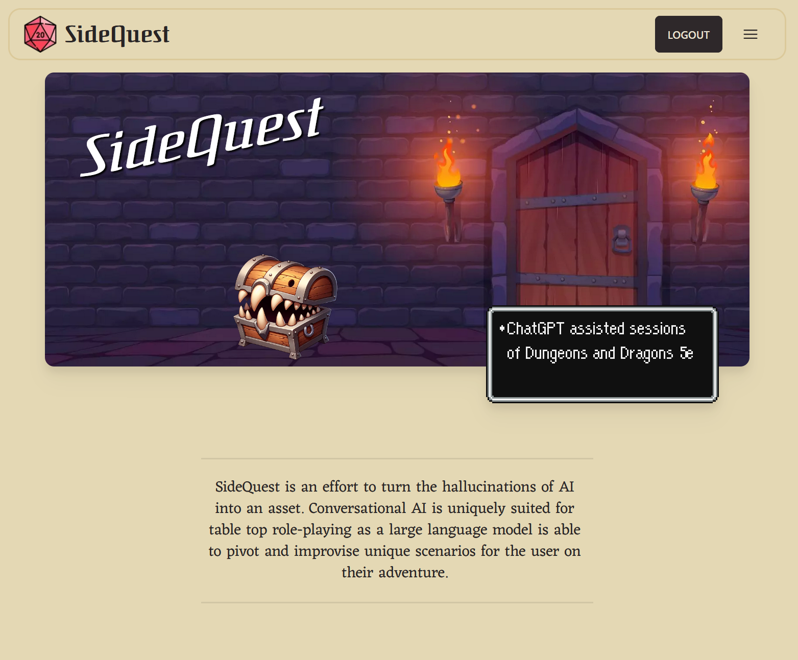
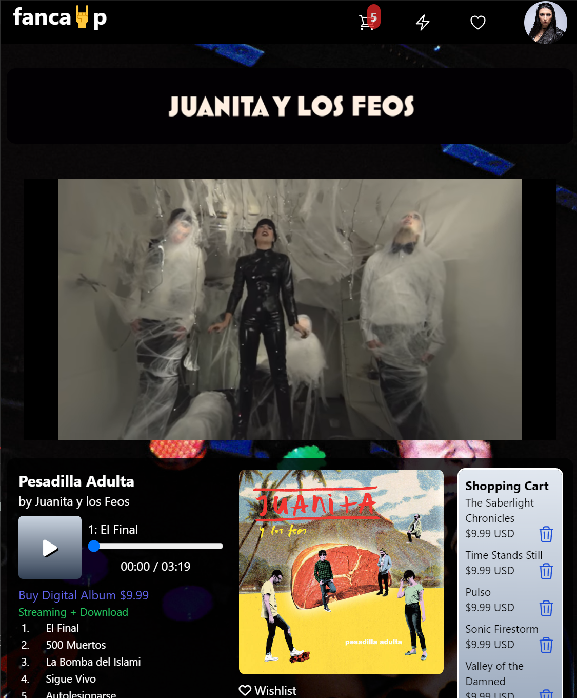
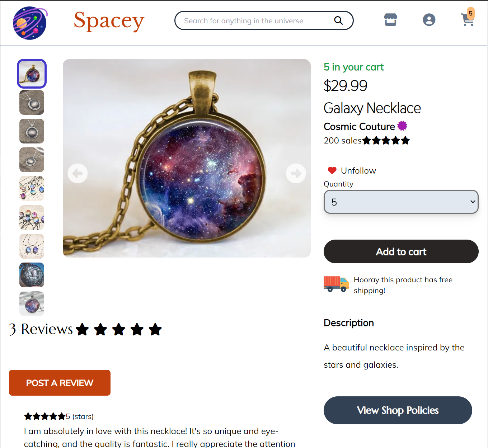
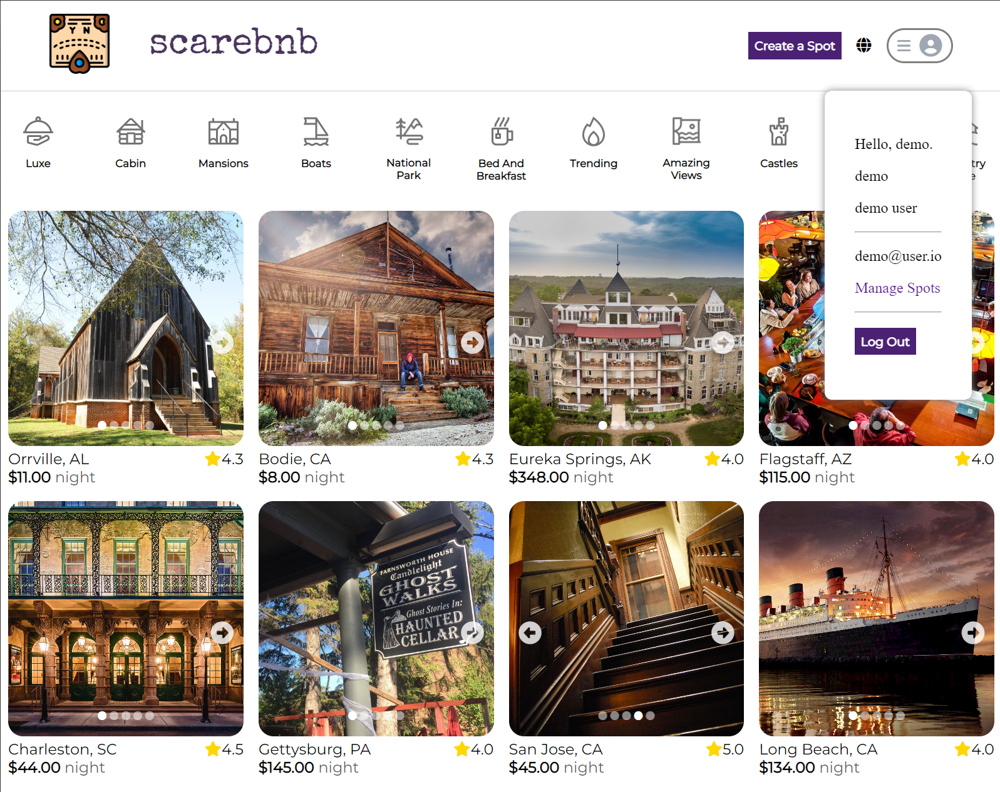

<!-- ☕Javascript | 📊SQL | 🎨HTML/CSS | 🐍Python | 📩Express.js | 🧪Flask | 🔰Node.js | ⚛Redux.js/React.js | ⚗SQLAlchemy | 💠Sequelize | 🐘Postgresql | 💨Tailwind CSS -->

<h2 style="font-size: 1.5rem; font-weight: bold;"> 👋 Hi! I'm Chris!</h2>

I'm a Software Engineer looking for a Full Stack Software Engineer position. I'm passionate about software that levels playing fields and changes the way we live our lives.

Before becoming a software engineer I was a Senior Installer doing residential solar installations. 🌞 It was from this work that I learned I enjoyed creative problem solving and wanted a career in which I was always learning and constantly being challenged, as well as the sense of completion that comes from ownership of a project in all aspects from start to finish.

I'm currently located in Portland, OR. But looking to relocate, given the right opportunity! Please feel free to contact me to discuss work opportunities or possible collaborations.

🌱 I’m currently learning Java and C#.
&nbsp;
<!-- 🤔I'm currently refactoring my past projects to make them as polished as possible, while also exploring new technologies and languages to add to my aresnal.⚔ -->
<h2 style="font-size: 1.5rem; font-weight: bold;">Technologies</h2>
&nbsp;

  

    
  

&nbsp;
<h2 style="font-size: 1.5rem; font-weight: bold;"> Projects</h2>
&nbsp;

  
  
  
  
  
  

<!--
**cludwell/cludwell** is a ✨ _special_ ✨ repository because its `README.md` (this file) appears on your GitHub profile.

<!-- Here are some ideas to get you started:

- 🔭 I’m currently working on ...
- 🌱 I’m currently learning ...
- 👯 I’m looking to collaborate on ...
- 🤔 I’m looking for help with ...
- 💬 Ask me about ...
- 📫 How to reach me: ...
- 😄 Pronouns: ...
- ⚡ Fun fact: ...
-->
